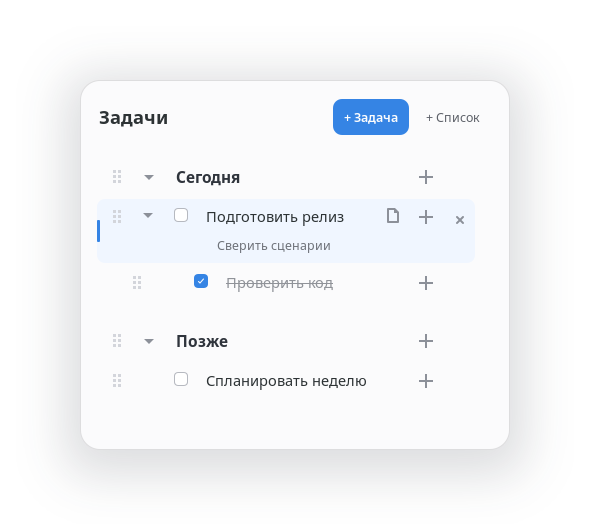

# Gvido — Gnome VIbecoded toDO

Карточка со списком дел и заметками в правом верхнем углу обзора GNOME Activities overview.



## Возможности

- Данные хранятся в `~/todo.md`: заголовки разных уровней, задачи с отметкой выполнения, подзадачи и многострочные заметки.
- Добавление задач, подзадач и списков прямо в виджете; редактирование текста на месте.
- Сворачивание списков, веток подзадач и заметок.
- Перетаскивание строк за маркер и перемещение с клавиатуры, в том числе между списками.
- Удаление задачи или списка с возможностью отмены во всплывающем уведомлении.
- Отмена и повтор изменений текста; `Esc` отменяет текущее редактирование, уход фокуса сохраняет его.
- Изменение размера с сохранением выбранного размера.
- Поддержка доступности: увеличенного системного текста, режима высокой контрастности, чтение с экрана и прочее.
- Горячая перезагрузка `runtime.js`, `config.json` и `theme.css` без перезапуска GNOME Shell.

## Сочетания клавиш

- При открытии обзора фокус переходит на выбранную строку, а если ничего не выбрано — на первую.
- `↑` / `↓`: выбрать предыдущую или следующую строку; `Enter`: перейти к её редактированию.
- `Alt+↑` / `Alt+↓`: переместить задачу или раздел.
- `↑` / `↓` на маркере перетаскивания: переместить строку выше или ниже.
- `Ctrl+Enter`: изменить отметку о выполнении задачи, в том числе при редактировании.
- `Ctrl+Z` / `Ctrl+Shift+Z`: отменить или повторить изменение текста при редактировании задачи или заголовка.
- `Esc`: отменить текущее редактирование; `Enter`: сохранить его и вернуться к выбору строки.
- `Delete`: удалить выбранную задачу или список. В редакторе клавиша, как обычно, удаляет текст.
- `↑` / `↓` и `←` / `→` на маркере размера: изменить высоту и ширину на 10 пикселей; с `Shift` — на 1 пиксель.

## Формат файла

```md
# Сейчас
- [ ] Задача
  - [ ] Вложенная задача
  - [x] Готовая задача

## Второй уровень заголовка
- [ ] Ещё задача
```

Для заголовков `Tab` и `Shift+Tab` меняют количество символов `#`, для задач — отступ на два пробела.

## Установка из распакованного каталога

```bash
./install.sh
```

Установщик проверяет UUID, копирует расширение в активный каталог данных XDG и добавляет его в `org.gnome.shell enabled-extensions`.
При обновлении он копирует `runtime.js`, `config.json` и `theme.css` из исходного каталога поверх установленных файлов; их изменение запускает горячую перезагрузку.
В сеансе Wayland оболочка обычно обнаруживает новый каталог расширения только при запуске. После первой установки выйдите из сеанса и войдите снова, затем проверьте расширение:

```bash
gnome-extensions info gvido@local
```

Команда должна показать, что расширение включено; повторно выполнять `gnome-extensions enable` не нужно.

## Установка из ZIP-архива

```bash
gnome-extensions install --force gvido@local.shell-extension.zip
gnome-extensions enable gvido@local
```
